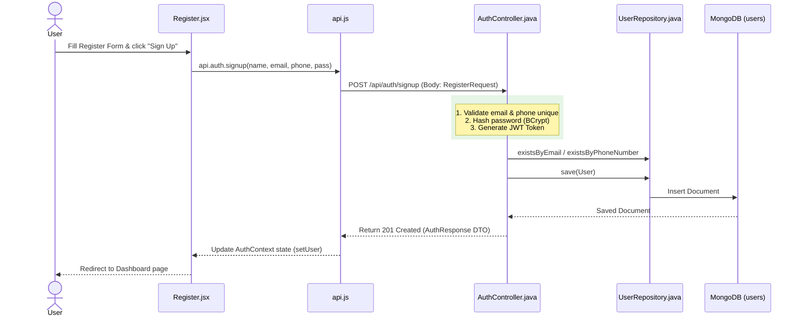
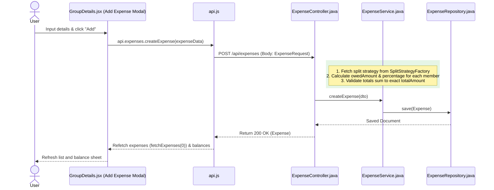
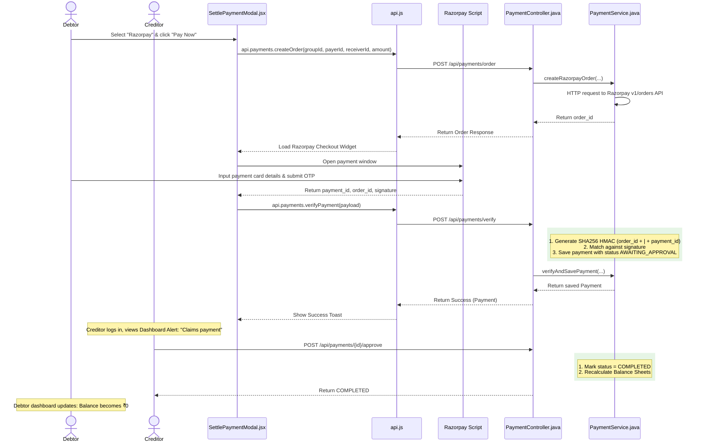

# 💸 FairShare - Bill Splitting & Settlement Application

FairShare is a premium full-stack bill splitting web application (inspired by Splitwise) built to manage group-level shared expenses, compute optimized debt resolutions, and process settlements through Cash or Razorpay online payments.

---

## 🏗️ Technical Stack

* **Frontend:** React 19, Vite 8, Tailwind CSS v4, Lucide React
* **Backend:** Spring Boot 3, Java 21, Spring Security (JWT-based authentication), Maven
* **Database:** MongoDB (using Spring Data MongoDB Repository)
* **Integrations:** Razorpay Payment Gateway API

---

## ⚙️ Prerequisites & Setup

### ☕ Spring Boot Backend
1. **Java Development Kit (JDK):** Ensure Java 21+ is installed.
2. **MongoDB Database:** Setup a local MongoDB instance or MongoDB Atlas.
3. **Environment Setup:** Create a `.env` file in the `backend/` directory:
   ```properties
   MONGO_URI=mongodb+srv://<username>:<password>@cluster.mongodb.net/FairShare
   JWT_SECRET=FAIRSHARE_SECRET_TOKEN_FOR_DEV_ONLY_SHOULD_BE_256_LONG
   RAZORPAY_KEY_ID=rzp_test_YourKeyId
   RAZORPAY_KEY_SECRET=YourKeySecret
   FRONTEND_URL=your_production_frontend_url (optional, defaults to http://localhost:5173)
   ```
4. **Run Server:**
   ```bash
   cd backend
   mvn spring-boot:run
   ```
   The backend runs on [http://localhost:8080](http://localhost:8080).

### ⚛️ React Frontend
1. **Node.js:** Ensure Node.js v26+ is installed.
2. **Install Packages:**
   ```bash
   cd frontend
   npm install
   ```
3. **Environment Setup:** Create a `.env` file in the `frontend/` directory:
   ```properties
   VITE_API_BASE_URL=your_production_backend_api_url (optional, defaults to http://localhost:8080)
   ```
4. **Run Dev Client:**
   ```bash
   npm run dev
   ```
   The frontend runs on [http://localhost:5173](http://localhost:5173).

---

## 🔄 End-to-End Workflows & Process Mapping

This section maps user actions to their exact code files, execution classes, endpoints, databases, and visual state modifications.

---

### 1. User Sign Up (Registration Flow)


* **Frontend Trigger:** User fills the fields inside `Register.jsx` and clicks the **Sign Up** button.
* **Frontend Controller & API Call:** `Register.jsx` triggers `signup(...)` from `AuthContext.jsx`, which calls `api.auth.signup(...)` in `api.js`.
* **HTTP Endpoint:** `POST /api/auth/signup`
  * **Payload:** `RegisterRequest` DTO `{ name, email, phoneNumber, password }`
* **Backend Processing:**
  * `AuthController.java` intercepts the request.
  * Validates uniqueness of credentials using `userRepository.existsByEmail(...)` and `userRepository.existsByPhoneNumber(...)` in `UserRepository.java`.
  * Hashes password via `passwordEncoder.encode(...)`.
  * Instantiates a new `User` entity, maps properties, and calls `userRepository.save(user)` writing to the `users` collection.
  * Generates a secure authentication JWT token via `jwtUtil.generateToken(...)`.
* **API Response:** Returns `AuthResponse` DTO containing `token`, `tokenType`, `id`, `name`, `email`, and `phoneNumber`.
* **Frontend View Update:** `AuthContext.jsx` saves user info to local state (`user`), setting `isAuthenticated` to true. React Router redirects the user to the `Dashboard.jsx` screen.

---

### 2. Group Creation
* **Frontend Trigger:** User clicks **Create Group** button in `Dashboard.jsx`, opening the group creator form.
* **Frontend Controller & API Call:** `Dashboard.jsx` handles state fields and triggers `api.groups.createGroup(...)` in `api.js`.
* **HTTP Endpoint:** `POST /api/groups`
  * **Headers:** `Authorization: Bearer <token>`
  * **Payload:** JSON group schema `{ name, type, memberIds }`
* **Backend Processing:**
  * `GroupController.java` receives the payload.
  * It verifies authorization, calls `GroupService.java` to map properties, and inserts a new document in MongoDB via `groupRepository.save(group)`.
* **API Response:** Returns the newly saved `Group` entity object.
* **Frontend View Update:** Dashboard component updates the `groups` state array via `setGroups([...groups, newGroup])`. The page re-renders to show the new group card.

---

### 3. Adding an Expense (Equal / Exact / Percentage Split)


* **Frontend Trigger:** User opens the "Log Group Expense" modal in `GroupDetails.jsx`, inputs description, total amount, selects payer, split type, and members, then clicks **Save**.
* **Frontend API Call:** Triggers `api.expenses.createExpense(expenseData)` in `api.js`.
* **HTTP Endpoint:** `POST /api/expenses`
  * **Payload:** `{ groupId, description, totalAmount, paidById, splitType, splitDetails }`
* **Backend Processing:**
  * `ExpenseController.java` routes the payload.
  * `ExpenseService.java` dynamically resolves the splitting strategy using `SplitStrategyFactory.java`:
    * **`EQUAL`:** Splits the bill equally among members (`amount / memberCount`).
    * **`EXACT`:** Checks that the custom input shares exactly match the total amount.
    * **`PERCENTAGE`:** Allocates amounts using user percentages (`amount * percentage / 100`) and asserts that the sum equals 100%.
  * Computes the individual `owedAmount` details and writes the transaction to the `expenses` collection.
* **API Response:** Returns the fully calculated `Expense` document.
* **Frontend View Update:** `GroupDetails.jsx` catches the callback, closes the modal, and runs `fetchExpenses(0)` and `fetchBalancesAndSimplification()`. This triggers a fresh fetch of:
  * Running expenses (refreshing the list layout).
  * Raw individual balances and simplified debt structures.

---

### 4. Expense Deletion (Cascade Effect)
* **Frontend Trigger:** User clicks the **Trash** icon on an `ExpenseCard.jsx` and confirms deletion.
* **Frontend API Call:** Triggers `api.expenses.deleteExpense(expenseId)` in `api.js`.
* **HTTP Endpoint:** `DELETE /api/expenses/{expenseId}`
* **Backend Processing:**
  * `ExpenseController.java` processes the request.
  * `ExpenseService.java` deletes the expense document from the `expenses` collection.
  * **Cascade Deletes Hook:** Triggers deletion of any associated cash/online payment records linked to this expense ID from the `payments` collection to ensure balance sheets stay integral.
* **API Response:** Returns `200 OK` (or `244 No Content`).
* **Frontend View Update:** Frontend refetches group details and balance sheets. The deleted expense card disappears, and balances adjust back as if the expense never existed.

---

### 5. Settle Up (Online Payment via Razorpay Gateway)


* **Frontend Trigger:** Debtor clicks **Settle Up** (from the header or card), selects **Razorpay** in `SettlePaymentModal.jsx`, inputs the amount, and clicks **Pay Now**.
* **Frontend API Call 1 (Create Order):** Triggers `api.payments.createOrder(...)` in `api.js`.
* **HTTP Endpoint 1:** `POST /api/payments/order`
  * **Payload:** `{ groupId, payerId, receiverId, amount }`
* **Backend Processing 1 (Razorpay Order):**
  * `PaymentController.java` receives the request.
  * `PaymentService.java` calls Razorpay's `/v1/orders` endpoint via `RestTemplate` with basic authorization (using `RAZORPAY_KEY_ID` and `RAZORPAY_KEY_SECRET`), specifying the amount in paise.
* **API Response 1:** Returns Razorpay Order ID.
* **Frontend Trigger 2 (Razorpay Widget):** The React modal launches the Razorpay checkout overlay. The user fills in credit card details and OTP. Razorpay completes checkout and returns transaction tokens (`razorpay_payment_id`, `razorpay_order_id`, `razorpay_signature`).
* **Frontend API Call 2 (Verify Signature):** Triggers `api.payments.verifyPayment(...)` in `api.js`.
* **HTTP Endpoint 2:** `POST /api/payments/verify`
  * **Payload:** `{ groupId, payerId, receiverId, amount, razorpayOrderId, razorpayPaymentId, razorpaySignature }`
* **Backend Processing 2 (Signature Check):**
  * `PaymentService.java` verifies the transaction authenticity. It computes a cryptographic SHA256 HMAC of the concatenated string `razorpayOrderId + "|" + razorpayPaymentId` signed with `RAZORPAY_KEY_SECRET`.
  * If it matches the client's signature, a transaction record is created in MongoDB with **`status = AWAITING_APPROVAL`**.
* **API Response 2:** Returns verified `Payment` document.
* **Frontend View Update:** Closes modal and shows toast alerting that confirmation is pending.
* **Recipient Approval Loop:**
  * The recipient (`Creditor`) logs in and sees an alert badge under **Payments Awaiting Your Confirmation** in `GroupDetails.jsx`.
  * Creditor clicks **Confirm Receipt**.
  * Hits `POST /api/payments/{paymentId}/approve`.
  * `PaymentService` updates the status to **`COMPLETED`**.
  * Balance sheet calculations reload, reflecting the resolved debt.

---

## 📋 Backend API Route Reference

All controllers are secured with token validation interceptors mapping users dynamically through the security context.

### 🔐 Authentication (`/api/auth`)
* `POST /signup` - Register a new account. Checks email/phone unique constraint.
* `POST /login` - Sign in. Validates password hashes and returns a JWT token.

### 👤 User Profiles (`/api/users`)
* `GET /lookup?identifier={val}` - Find a user's basic profile details by Email or Phone Number. Used to search and invite users to groups.
* `GET /profile` - Retrieve the current authenticated user's profile card.
* `PUT /profile` - Update the user's name or phone number.
* `GET /{userId}` - Retrieve basic details of a user by ID.

### 👥 Groups (`/api/groups`)
* `POST /` - Create a group with type and initial member array.
* `GET /` - Fetch all groups the authenticated user is a member of.
* `GET /{groupId}` - Get details of a single group.
* `PUT /{groupId}/rename` - Rename an existing group.
* `DELETE /{groupId}` - Delete a group, automatically cascading to delete all its expenses and payments.

### 💸 Expenses (`/api/expenses`)
* `POST /` - Create a new expense. Calculates splits based on strategy.
* `PUT /{expenseId}` - Edit an expense description, amount, split distributions, or payer.
* `DELETE /{expenseId}` - Delete an expense, cascading delete to any payment logs.
* `GET /group/{groupId}?page={X}&size={Y}` - Fetch paginated chronological expenses logged in a group.

### ⚖️ Balances & Settlements (`/api/balances` & `/api/payments`)
* `GET /balances/group/{groupId}/user/{userId}` - Calculates individual balance sheets relative to the user.
* `GET /balances/group/{groupId}/simplify?algo={GREEDY|DFS}` - Run path optimization engines on group balances.
* `POST /payments/order` - Create a new transaction order with Razorpay.
* `POST /payments/verify` - Cryptographically verify online payments and save as `AWAITING_APPROVAL`.
* `POST /payments/cash` - Record manual cash settlement.
  * *Rules:* If recorded by the creditor, saves directly as `COMPLETED`. If recorded by the debtor, saves as `AWAITING_APPROVAL`.
* `POST /payments/{paymentId}/approve` - Accept payment claim. Marks transaction as `COMPLETED`.
* `POST /payments/{paymentId}/reject` - Reject payment claim. Marks transaction as `REJECTED`.
* `GET /payments/group/{groupId}` - Fetch all transactions logged within a group.

### 🩺 System Diagnostics (`/api/health`)
* `GET /health/db` - Verifies database connectivity and returns Atlas diagnostic response state.

---

## 🧮 Balance Calculation & Optimization Model

### Raw Net Balances
Balances are calculated at the group level using:
$$\text{Net User Balance} = \sum (\text{Bills Paid}) - \sum (\text{Owed Split Shares}) + \sum (\text{Completed Payments Received}) - \sum (\text{Completed Payments Paid})$$

A positive balance designates a **Creditor** (owed money); a negative balance designates a **Debtor** (owes money).

### Debt Simplification Engines
* **Greedy Algorithm:** Matches the largest debtor to the largest creditor in a priority queue. It simplifies transaction counts in $\mathcal{O}(N \log N)$ time.
* **DFS Backtracking:** Iterates through combination paths to eliminate cycles and cancel redundant paths, producing mathematically optimal settlement networks.
